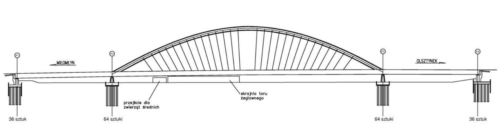
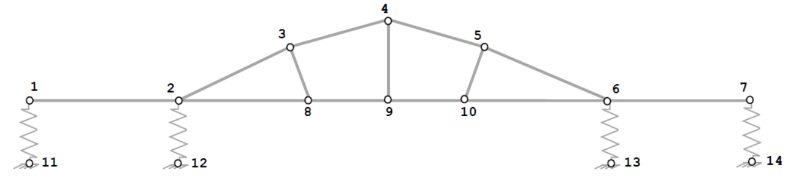

**<h1 align=center> Reactions and Internal Forces on the Bridge Over the Pauzeński Canal</h1>**

## Statement

In this work, we are going to determine and calculate internal forces(M, N, T) and reactions of supports in the bridge structure using spring and plane frame elements. To do that, we should determine the distances between nodes (lenghts of the elements) as $m$ and force on the bridge as $kN/m$. Functions taken from [MATLAB Guide To Finite Elements](https://www.mathworks.com/academia/books/matlab-guide-to-finite-elements-kattan.html) book.

 

## Description

### What are internal forces?

Internal forces are produced from the external forces acting on structure members such as poled, beamd or columnd. Generally, we have three types of internal forces: axial, dhear and moment. Axial force, sometimes called ***normal force***, is a compression or tension force acting aligned with the extension of a structure member. Shear force is a force acting in a direction perpendicular to the alignment of the member.

Moment force, lastly, is a turning result of a force multiplied by the distance from its acting location to the turning point. The number of these components varies in one-dimensional, two-dimensional and three-dimensional cases. Now the questions are what each of these components do and how to calculate these internal forces.

### What is spring element?

The spring element is a one-dimensional finite element where the local and global coordinates coincide. It should be noted that the spring element is the simplest finite element available.

<small>Fig.1 - Nodes</small>

<small>Fig.2 - Elements</small>

#### Necessery functions for calculading

Spring element on MATLAB:

    function y = SpringElementStiffness(k)
    %SpringElementStiffness   This function returns the element stiffness 
    %                         matrix for a spring with stiffness k. 
    %                         The size of the element stiffness matrix
    %                         is 2 x 2.
    y = [k -k ; -k k];

Spring Assemble on MATLAB:

    function y = SpringAssemble(K,k,i,j)
    %SpringAssemble   This function assembles the element stiffness
    %                 matrix k of the spring with nodes i and j into the
    %                 global stiffness matrix K.
    %                 This function returns the global stiffness matrix K 
    %                 after the element stiffness matrix k is assembled.
    K(i,i) = K(i,i) + k(1,1);
    K(i,j) = K(i,j) + k(1,2);
    K(j,i) = K(j,i) + k(2,1);
    K(j,j) = K(j,j) + k(2,2);
    y = K;

### What is plane frame element?

The plane frame element is a two-dimensional finite element with both local and global coordinates. The plane frame element has modulus of elasticity $E$, moment of inertia $I$, cross-sectional area $A$, and length $L$. Each plane frame element has two nodes and is inclined with an angle $θ$ measured counterclockwise from the positive global X axis.

<small>Fig.3 - Elements orientation</small>

#### Necessery functions for calculading

Plane Frame Element Length on MATLAB:

	function y = PlaneFrameElementLength(x1,y1,x2,y2)
	%PlaneFrameElementLength   This function returns the length of the
	%                          plane frame element whose first node has  
	%                          coordinates (x1,y1) and second node has  
	%                          coordinates (x2,y2).   
	y = sqrt((x2-x1)*(x2-x1) + (y2-y1)*(y2-y1));

Plane Frame Element Stiffness on MATLAB:

	function y = PlaneFrameElementStiffness(E,A,I,L,theta)
	%PlaneFrameElementStiffness   This function returns the element 
	%                             stiffness matrix for a plane frame   
	%                             element with modulus of elasticity E,  
	%                             cross-sectional area A, moment of 
	%                             inertia I, length L, and angle 
	%                             theta (in degrees).
	%                             The size of the element stiffness 
	%                             matrix is 6 x 6.
	x = theta*pi/180;
	C = cos(x);
	S = sin(x);
	w1 = A*C*C + 12*I*S*S/(L*L);
	w2 = A*S*S + 12*I*C*C/(L*L);
	w3 = (A-12*I/(L*L))*C*S;
	w4 = 6*I*S/L;
	w5 = 6*I*C/L;
	y = E/L*[w1 w3 -w4 -w1 -w3 -w4 ; w3 w2 w5 -w3 -w2 w5 ;
	   -w4 w5 4*I w4 -w5 2*I ; -w1 -w3 w4 w1 w3 w4 ;
	   -w3 -w2 -w5 w3 w2 -w5 ; -w4 w5 2*I w4 -w5 4*I];

Plane Frame Assemble on MATLAB:

	function y = PlaneFrameAssemble(K,k,i,j)
	%PlaneFrameAssemble   This function assembles the element stiffness
	%                     matrix k of the plane frame element with nodes
	%                     i and j into the global stiffness matrix K.
	%                     This function returns the global stiffness  
	%                     matrix K after the element stiffness matrix  
	%                     k is assembled.
	K(3*i-2,3*i-2) = K(3*i-2,3*i-2) + k(1,1);
	K(3*i-2,3*i-1) = K(3*i-2,3*i-1) + k(1,2);
	K(3*i-2,3*i) = K(3*i-2,3*i) + k(1,3);
	K(3*i-2,3*j-2) = K(3*i-2,3*j-2) + k(1,4);
	K(3*i-2,3*j-1) = K(3*i-2,3*j-1) + k(1,5);
	K(3*i-2,3*j) = K(3*i-2,3*j) + k(1,6);
	K(3*i-1,3*i-2) = K(3*i-1,3*i-2) + k(2,1);
	K(3*i-1,3*i-1) = K(3*i-1,3*i-1) + k(2,2);
	K(3*i-1,3*i) = K(3*i-1,3*i) + k(2,3);
	K(3*i-1,3*j-2) = K(3*i-1,3*j-2) + k(2,4);
	K(3*i-1,3*j-1) = K(3*i-1,3*j-1) + k(2,5);
	K(3*i-1,3*j) = K(3*i-1,3*j) + k(2,6);
	K(3*i,3*i-2) = K(3*i,3*i-2) + k(3,1);
	K(3*i,3*i-1) = K(3*i,3*i-1) + k(3,2);
	K(3*i,3*i) = K(3*i,3*i) + k(3,3);
	K(3*i,3*j-2) = K(3*i,3*j-2) + k(3,4);
	K(3*i,3*j-1) = K(3*i,3*j-1) + k(3,5);
	K(3*i,3*j) = K(3*i,3*j) + k(3,6);
	K(3*j-2,3*i-2) = K(3*j-2,3*i-2) + k(4,1);
	K(3*j-2,3*i-1) = K(3*j-2,3*i-1) + k(4,2);
	K(3*j-2,3*i) = K(3*j-2,3*i) + k(4,3);
	K(3*j-2,3*j-2) = K(3*j-2,3*j-2) + k(4,4);
	K(3*j-2,3*j-1) = K(3*j-2,3*j-1) + k(4,5);
	K(3*j-2,3*j) = K(3*j-2,3*j) + k(4,6);
	K(3*j-1,3*i-2) = K(3*j-1,3*i-2) + k(5,1);
	K(3*j-1,3*i-1) = K(3*j-1,3*i-1) + k(5,2);
	K(3*j-1,3*i) = K(3*j-1,3*i) + k(5,3);
	K(3*j-1,3*j-2) = K(3*j-1,3*j-2) + k(5,4);
	K(3*j-1,3*j-1) = K(3*j-1,3*j-1) + k(5,5);
	K(3*j-1,3*j) = K(3*j-1,3*j) + k(5,6);
	K(3*j,3*i-2) = K(3*j,3*i-2) + k(6,1);
	K(3*j,3*i-1) = K(3*j,3*i-1) + k(6,2);
	K(3*j,3*i) = K(3*j,3*i) + k(6,3);
	K(3*j,3*j-2) = K(3*j,3*j-2) + k(6,4);
	K(3*j,3*j-1) = K(3*j,3*j-1) + k(6,5);
	K(3*j,3*j) = K(3*j,3*j) + k(6,6);
	y = K;

You can check Advanced Structural Analysis by Prof. Devdas Menon on [Matrix Analysis of Plane and Space Frames](https://www.youtube.com/watch?v=FywVplNrSJQ&ab_channel=nptelhrd).

 

## Coding for Calculations

First of all, we made all the necessary functions on Octave such as **SpringElementStiffness**, **SpringAssemble**, **PlaneFrameElementLength**, **PlaneFrameElementStiffness** and **PlaneFrameAssemble**. We are going to use them in code, and we are going to place convenient values into them.

<small>Fig.4 - Spring and frame elements</small>

### Spring elements:

$$ks1 = 10^5 kN/m$$

$$ks2 = 2 \cdot 10^5 kN/m$$

### Plane frame elements:

$$E = 210 \cdot 10^6 kPa$$ 

$$A = 0.75 m^2$$

$$I = 0.141 m^4$$

 

Spring and plane frame elements on MATLAB:

    E = 210e6 % kPa
    A = 0.75 % m²
    I = 0.141 % m4
    q = 20 % kN/m
    rad2deg = 180 / pi; % degree

    ks1 = SpringElementStiffness(1e5) % kN/m
    ks2 = SpringElementStiffness(2e5) % kN/m

### Lengths

<small>Fig.5 - Lengths</small>

We need to determine the lenghts with using **PlaneFrameElementLength**.

	L1 = 70 % m
	L2 = PlaneFrameElementLength(0, 0, 60, 26) % m
	L3 = PlaneFrameElementLength(0, 0, 40, 4) % m
	L4 = PlaneFrameElementLength(0, 0, 40, -4) % m
	L5 = PlaneFrameElementLength(0, 0, 60, -26) % m
	L6 = 70 % m
	L7 = 65 % m
	L8 = 35 % m
	L9 = 35 % m
	L10 = 65 % m
	L11 = PlaneFrameElementLength(0, 0, -5, 26) % m
	L12 = 30 % m
	L13 = PlaneFrameElementLength(0, 0, 5, 26) % m

### Degrees

We need to determine the degrees with using <code>rad2deg</code>.

    theta1 = atan(26 / 60) * rad2deg;
    theta2 = atan(4 / 40) * rad2deg;
    theta3 = 360 - theta2;
    theta4 = 360 - theta1;
    theta5 = 270 + atan(5 / 26) * rad2deg;
    theta6 = 270 - atan(5 / 26) * rad2deg;

### Building global stiffness matrix for the structure

	k1 = PlaneFrameElementStiffness(E, A, I, L1, 0);
	k2 = PlaneFrameElementStiffness(E, A, I, L2, theta1);
	k3 = PlaneFrameElementStiffness(E, A, I, L3, theta2);
	k4 = PlaneFrameElementStiffness(E, A, I, L4, theta3);
	k5 = PlaneFrameElementStiffness(E, A, I, L5, theta4);
	k6 = PlaneFrameElementStiffness(E, A, I, L6, 0);
	k7 = PlaneFrameElementStiffness(E, A, I, L7, 0);
	k8 = PlaneFrameElementStiffness(E, A, I, L8, 0);
	k9 = PlaneFrameElementStiffness(E, A, I, L9, 0);
	k10 = PlaneFrameElementStiffness(E, A, I, L10, 180);
	k11 = PlaneFrameElementStiffness(E, A, I, L11, theta5);
	k12 = PlaneFrameElementStiffness(E, A, I, L12, 270);
	k13 = PlaneFrameElementStiffness(E, A, I, L13, theta6);

### Assembling the global stiffness matrix

First, we obtain K. Then, we make a zero matrix of size $34x34$, then make 13 calls for the plane elements and 3 calls for the spring elements with the MATLAB function **PlaneFrameAssemble** and SpringAssemble since we have 13 plane frame elements in the structure. Each call to the function will assemble one element which is K.

<small>Fig.6 - Degrees of Freedom</small>

The number of degrees of freedom (DoF) is calculated for plane frame elements only. The springs have also DoF: nodes 11, 12, 13 and 14 - every node has one DoF, so total number of DoFs:

$$DoFs = 10 \cdot 3 + 4 \cdot 1 =34$$

	K = zeros(34, 34);

	K = PlaneFrameAssemble(K, k1, 1, 2);
	K = PlaneFrameAssemble(K, k2, 2, 3);
	K = PlaneFrameAssemble(K, k3, 3, 4);
	K = PlaneFrameAssemble(K, k4, 4, 5);
	K = PlaneFrameAssemble(K, k5, 5, 6);
	K = PlaneFrameAssemble(K, k6, 6, 7);
	K = PlaneFrameAssemble(K, k7, 2, 8);
	K = PlaneFrameAssemble(K, k8, 8, 9);
	K = PlaneFrameAssemble(K, k9, 9, 10);
	K = PlaneFrameAssemble(K, k10, 6, 10);
	K = PlaneFrameAssemble(K, k11, 3, 8);
	K = PlaneFrameAssemble(K, k12, 4, 9);
	K = PlaneFrameAssemble(K, k13, 5, 10);

	K = SpringAssemble(K, ks1, 2, 31);
	K = SpringAssemble(K, ks2, 5, 32);
	K = SpringAssemble(K, ks2, 17, 33);
	K = SpringAssemble(K, ks1, 20, 34);

### Applying the boundary conditions

The last arguments of the **SpringAssemble** function are node numbers only for systems that contain only spring elements (no other element types). Since spring nodes have only one degree of freedom, you have to provide freedom degree numbers instead of node numbers to properly assemble the springs.

<small>Fig.7 - Nodal forces</small>

Now we need to extract 30 columns and 30 rows from the global stiffness matrix.

    k = K(1:30,1:30);
    f = [0; -700; -8167; 0; -1350; 1125; 0; 0; 0; 0; 0; 0; 0; 0; 0; 0; -1350; -1125; 0; -700; 8167; 0; -1000; 5000; 0; -700; 0; 0; -1000; -5000];
    u = k\f

The backslash operator “\” is used for Gaussian elimination. We can clearly see our displaments at nodes. 

**Rotations at nodes (as $rad$):**

 - Positive numbers: Counterclock-wise
 - Negative numbers: Clockwise.

### Post-processing

In this step, finally, we obtain the reactions at nodes 1st, 2nd, 6th, 7th, 8th, 9th, and 10th forces (axial forces, shears, and moments) in each plane frame element using MATLAB as follows. First, we set up the global nodal displacement vector $U$, then we calculate the global nodal force vector $F$ (as $kN$).

**Reactions in each nodes (as $kN$):**

 - Positive numbers: upward 
 - Negative numbers: downward

We have just calculated internal forces(M, N, T) and reactions of supports in the bridge structure using spring and plane frame elements. For more details, please check **Presentation about Bridge Over the Pauzeński Canal.pdf** file.

## Contact Me

If you have something to say to me please contact me: 

 - Twitter: [Doguilmak](https://twitter.com/Doguilmak)  
 - Mail address: doguilmak@gmail.com
